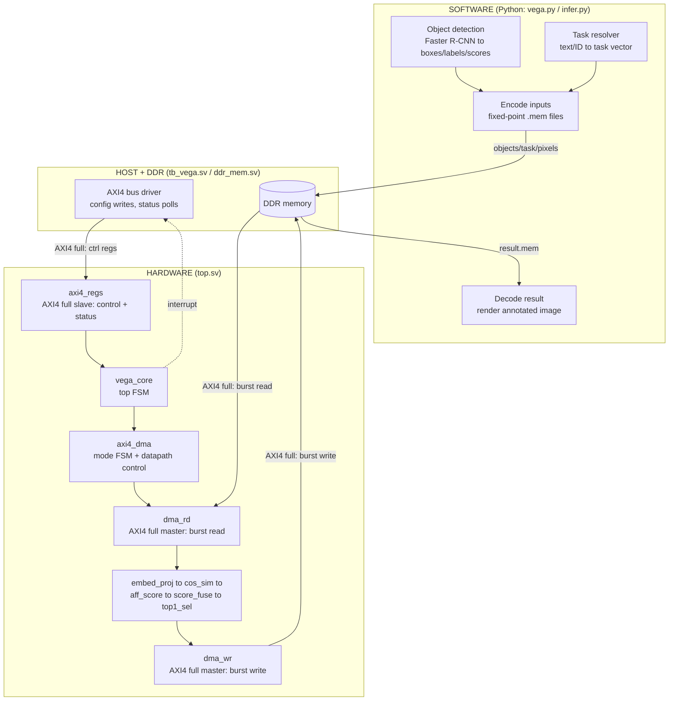
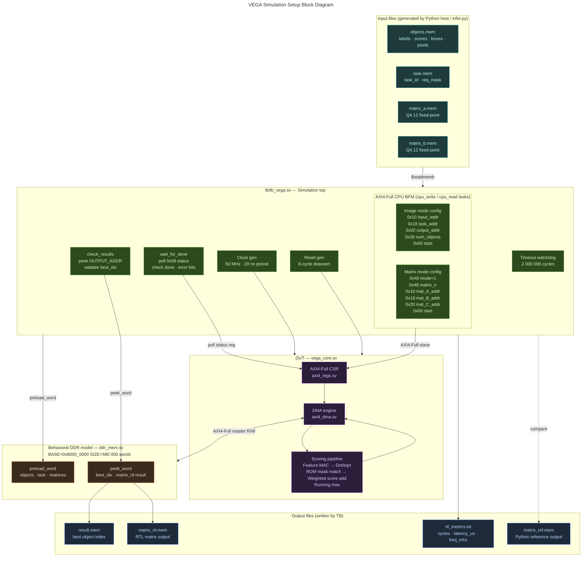
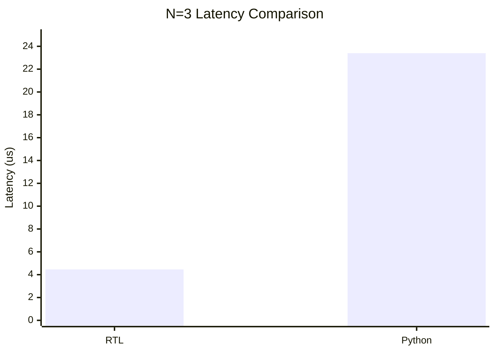

# TriVega Accelerator Project Report

## Introduction

The project implements a system that takes an image and a task description, then identifies the most appropriate object in the scene based on task relevance rather than generic object detection alone as a software-assisted, FPGA-oriented pipeline: software prepares COCO-style object candidates and task encodings, while RTL performs fixed-point scoring, affordance matching, fusion, and best-object selection through a custom AXI4-controlled accelerator.

## 1. Block Diagram of the Design

The system addresses task-aware object selection problem: given an image and one of the 14 reference tasks, the system selects the most appropriate object in the scene. The design uses software to prepare COCO object candidates and task information, then uses a custom fixed-point RTL accelerator to score and select the best object.



The register/control interface is custom AXI4-style. The slave-side register block exposes AXI4 full-style channels and sideband signals, while the accelerator uses an AXI4 full master interface for DDR access.

## 2. Simulation Setup Block Diagram



Simulation is driven by `tb/tb_vega.sv`. The testbench creates default image/task memory files if absent, configures the accelerator through the custom AXI4 register interface, waits for completion, checks the image-mode result, and then runs matrix mode. Matrix mode writes `rtl_metrics.txt` with cycle count, latency, and clock frequency.

## 3. Summary of RTL

| RTL file | Summary |
| --- | --- |
| `rtl/top.sv` | Synthesis wrapper exposing slave AXI, master AXI, clock/reset, and interrupt. |
| `rtl/vega_core.sv` | Main controller. Validates configuration, controls `IDLE`, `ARMED`, `RUNNING`, `DONE`, and `ERR` states, tracks cycle/DMA counters, and connects registers to the DMA datapath. |
| `rtl/axi4_regs.sv` | Custom AXI4-style register/control bank for start/reset, status, base addresses, mode, object count, matrix size, cycle count, processed objects, DMA reads, and DMA writes. |
| `rtl/axi4_dma.sv` | Main datapath FSM. Supports image scoring and matrix multiplication; sequences DDR reads, ROI packing, feature projection, similarity, affordance scoring, score fusion, top-1 selection, and DDR writes. |
| `rtl/dma_rd.sv` | AXI4 burst read engine for input, task, and matrix data. |
| `rtl/dma_wr.sv` | AXI4 burst write engine for scores, best index, and matrix output. |
| `rtl/embed_proj.sv` | Fixed-point multiply-accumulate projection stage reused by image and matrix modes. |
| `rtl/cos_sim.sv` | Fixed-point cosine-style similarity computation. |
| `rtl/aff_score.sv` | Object affordance lookup and task affordance matching. |
| `rtl/score_fuse.sv` | Weighted fusion of detection, similarity, and affordance scores. |
| `rtl/top1_sel.sv` | Selects the best-scoring object. |

Key design parameters:

| Item | Value |
| --- | --- |
| Data format | 16-bit fixed point, `FRAC=12` |
| AXI data width | 64 bits |
| Maximum objects | 16 in RTL, 13 in default testbench |
| Maximum burst length | 16 beats |
| Image input limit | 816 x 648 pixels |
| Scene cache | 196,608 pixels |
| ROI samples per object | 256 |
| Matrix mode | `N=1..4` |
| Simulation clock | 50 MHz, 20 ns period |
| Contest target | VEGA processor on Genesys-2 FPGA board |
| Current Vivado script target | Kintex-7 `xc7k160tffg676-2` substitute part |

Main register map:

| Offset | Register |
| --- | --- |
| `0x00` | Control, start, soft reset |
| `0x08` | Status: done, error, state, object count |
| `0x10` | Input base address |
| `0x18` | Task or matrix-B base address |
| `0x20` | Output base address |
| `0x28` | Number of objects or matrix dimension copy |
| `0x30` | Cycle counter |
| `0x34` | Objects processed |
| `0x38` | DMA read beat counter |
| `0x3C` | DMA write beat counter |
| `0x40` | Mode: `0=image`, `1=matmul` |
| `0x48` | Matrix dimension `N` |

## 4. Simulation Results

Simulation was run from the project root using:

```powershell
make sim
```
Observed Output:


The Questa/ModelSim run completed successfully with zero compile warnings, zero compile errors, zero simulation warnings, and zero simulation errors.

| Test | Observed result |
| --- | --- |
| Image mode | Passed. `result.mem` contains best object index `0`, valid for the default `NUM_OBJECTS=13` testbench stimulus. |
| Matrix mode | Passed for `N=3`. RTL generated `matrix_rtl.mem` and `rtl_metrics.txt`. |
| Overall result | `TB PASS` |
| RTL/software comparison | Matrix RTL output matches the Python reference bit-for-bit. |

Generated result files:

| File | Purpose |
| --- | --- |
| `result.mem` | Best object index from image mode. |
| `matrix_rtl.mem` | Matrix output produced by RTL. |
| `matrix_ref.mem` | Matrix output produced by Python reference flow. |
| `rtl_metrics.txt` | Contains cycle count, latency, and frequency. |
| `vsim.wlf` | Questa/ModelSim waveform database. |

Measured matrix-mode metrics:

| Metric | Value |
| --- | --- |
| Matrix size | `N=3` |
| RTL cycles | 223 |
| RTL latency | 4.460 us |
| RTL frequency | 50 MHz |
| Matrix output words | 9 |

## Synthesis Report

Vivado runs are launched from the project root using:

```powershell
make synth
make impl
make route
```

The current synthesis script targets the Kintex-7 substitute part `xc7k160tffg676-2`. Generated logs and reports are written under `outputs/logs/`, `outputs/reports/`, and the generated Vivado project directory.

### Synthesis Result

```text
<Add Vivado synthesis output here>
```

### Resource Utilization

Add the utilization numbers from the Vivado utilization report.

| Resource | Used | Available | Utilization |
| --- | ---: | ---: | ---: |
| LUT |  |  |  |
| LUTRAM |  |  |  |
| FF |  |  |  |
| BRAM |  |  |  |
| DSP |  |  |  |
| IO |  |  |  |
| BUFG |  |  |  |

### Timing Summary

Add the timing numbers from the Vivado timing summary report after implementation or route.

| Timing item | Value |
| --- | ---: |
| Target clock period | 20.000 ns |
| Target frequency | 50 MHz |
| Worst negative slack (WNS) |  |
| Total negative slack (TNS) |  |
| Worst hold slack (WHS) |  |
| Total hold slack (THS) |  |
| Worst pulse width slack (WPWS) |  |
| Timing status |  |

### Power Summary

Add the Vivado power report numbers after implementation or route.

| Power item | Value |
| --- | ---: |
| Total on-chip power |  |
| Dynamic power |  |
| Static power |  |
| Device static power |  |
| Design power budget |  |
| Junction temperature |  |
| Thermal margin |  |
| Confidence level |  |
## 5. Current Status

The project is currently at the RTL-verified accelerator stage. The hardware datapath, custom AXI4 register/control interface, AXI4 full DDR master path, behavioral DDR memory model, testbench, and Python input-generation flow are present and runnable. The software flow supports an input image with either a task ID or a natural-language task prompt. The task logic in sw/vega.py defines the 14 supported tasks and maps them into compact task IDs, while the object-processing path uses COCO-style object classes to prepare candidate records, bounding boxes, confidence scores, and image pixels for the accelerator.
The intended execution model is a VEGA-host-driven pipeline. In this flow, the VEGA processor prepares the input buffers in DDR, including object metadata, task data, image pixels, and output space. It then programs the accelerator registers with the input base address, task base address, output base address, object count, execution mode, and start command. Once started, the RTL accelerator performs AXI4 full DDR reads, executes the fixed-point scoring pipeline, writes the selected result back to DDR, and updates status/counter registers for host readback.
At present, this full control sequence is verified in RTL simulation through tb/tb_vega.sv. The simulation runs both image mode and matrix mode, confirms that image-mode selection returns a valid best object index, and confirms that matrix-mode output matches the Python reference. The next project step is system integration on the VEGA host platform: map the accelerator into the VEGA address space, port the current testbench/Python register sequence into a VEGA-side driver or bare-metal application, allocate DDR buffers from host software, and validate end-to-end image-task inference on the FPGA system.

## 6. Acceleration Achieved

The acceleration measurement uses matrix mode as the direct hardware/software comparison path. The software flow computes:

```text
hardware_acceleration = python_time_us / rtl_latency_us
rtl_latency_us = rtl_cycles / 50.0
```

Measured RTL metric:

```text
cycles=223
latency_us=4.460000
freq_mhz=50.000000
```

Hardware/software comparison for `N=3`:

```text
N=3
python_time_us=23.400
rtl_cycles=223
rtl_latency_us=4.460
hardware_acceleration=5.246638x
PASS: RTL output matches software
```

| Metric | Value |
| --- | --- |
| RTL clock | 50 MHz |
| RTL cycles | 223 |
| RTL latency | 4.460 us |
| Software reference time | 23.400 us |
| Acceleration achieved | 5.246638x, approximately 5.25x |


## Conclusion

TriVega demonstrates a complete RTL-verified accelerator flow for task-aware object selection using a custom AXI4-controlled datapath. The design integrates register programming, AXI4 full DDR access, fixed-point feature scoring, affordance matching, score fusion, top-1 selection, and a matrix-mode verification path within a self-checking simulation environment. Questa/ModelSim simulation verifies both image mode and matrix mode, while the matrix-mode comparison provides a measurable hardware/software acceleration result. Vivado synthesis, utilization, timing, and power reports provide the implementation evidence needed to evaluate FPGA resource cost and timing feasibility. The next step is to connect the verified accelerator to the VEGA host software flow on the target FPGA platform, map the control registers and DDR buffers into the system address space, and validate end-to-end task-aware inference on hardware
